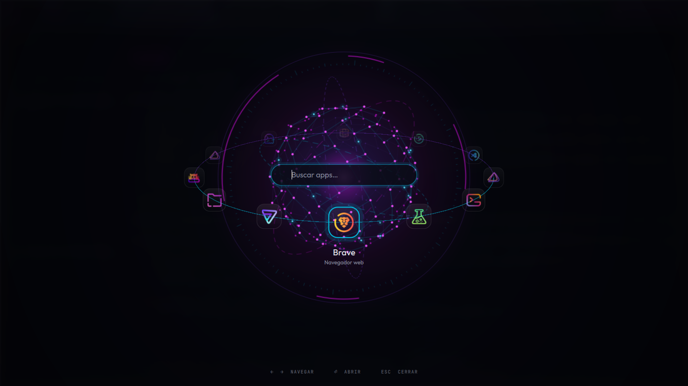
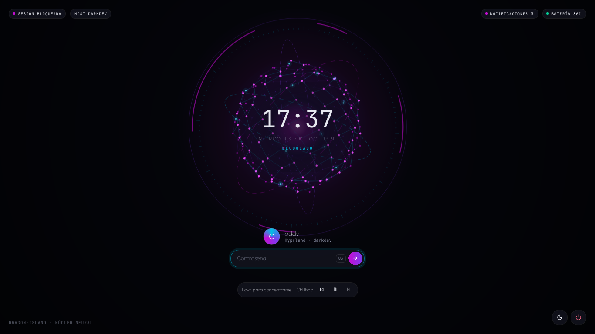
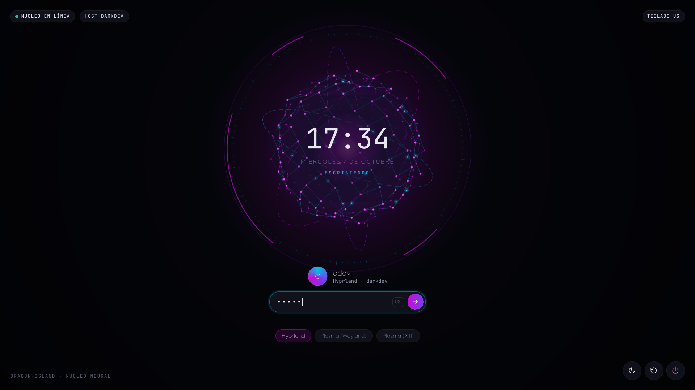

# dragon-island

Escritorio **Hyprland + Quickshell** para EndeavourOS, instalado como **segunda sesión junto a KDE Plasma** (Plasma no se toca). Tiene una barra flotante de tres islas, un **notch** pegado al borde superior que se expande (estilo NotchNook), popovers para cada indicador, centro de notificaciones, lanzador, portapapeles y menú de energía. Usa la paleta Sweet / Garuda Dragonized.

| Lanzador orbital (núcleo neural) | Pantalla de bloqueo | Tema de login (SDDM) |
|---|---|---|
|  |  |  |

Más capturas: [islas](docs/screenshots/islas) y [dock](docs/screenshots/dock). El checklist para hacer las que faltan está en [docs/TESTING.md](docs/TESTING.md).

## Qué incluye

| Pieza | Detalle |
|---|---|
| **Hyprland 0.56** | Configuración en **Lua** (`config/hypr/*.lua`), borde con degradado, blur, animaciones, reglas de capa para el shell |
| **Plugins** | `hyprbars` (barra de título de 30 px, botones a la izquierda), `hyprfocus` y `hyprglass` (cristal líquido), instalados con `hyprpm` |
| **Barra** | Isla izquierda (lanzador, escritorios 1–5, ventana activa) e isla derecha (CPU, RAM, Wi‑Fi, Bluetooth, volumen, batería, bandeja del sistema, notificaciones, reloj). Los huecos dejan pasar el clic |
| **Notch** | Negro opaco pegado al borde superior, con orejas cóncavas; emerge del borde al arrancar y nunca se superpone a las islas de la barra. Al pasar el ratón se asoma (peek). Muestra OSD, notificación, cambio de escritorio, música o el reloj. Al pulsarlo (o SUPER+D) crece hasta ≈720×230 con las pestañas Nook y Tray |
| **Notificaciones** | Popups (hasta 3, bajo la isla derecha), un peek del notch y el centro de notificaciones |
| **Notch expandido** | Pestaña Nook: música, tira de calendario, toggles rápidos (Wi‑Fi, Bluetooth, No molestar, luz nocturna) y estadísticas. Pestaña Tray: la bandeja del sistema |
| **Popovers** | Rendimiento, Wi‑Fi, Bluetooth, Sonido (con mezclador por app), Batería, Notificaciones y Calendario (eventos de **khal**) |
| **Lanzador orbital** | `SUPER + Espacio`: el **núcleo neural** es el planeta, la búsqueda está en su centro y las apps giran en un anillo inclinado (la mitad de atrás pasa detrás de la esfera). Búsqueda difusa con memoria de uso, favoritos (`Ctrl+F`), `=cálculo`, `>comando`, `+nombre` (Tienda) y `Ctrl+I` sin resultados. El núcleo late al escribir, se pone rojo sin resultados y se expande en verde al lanzar |
| **Dock en arco** | Una semidona de cristal (una franja como las islas, hueca por dentro, con las apps en cápsulas) que emerge del borde inferior (o izquierdo / derecho) con las apps fijadas, las abiertas y las minimizadas, puntos de ventanas, insignias de notificaciones, ampliación al pasar el ratón y abanico de descargas. Aparece cuando el escritorio no tiene ventanas en mosaico |
| **Islas dinámicas** | Las cápsulas aparecen solo cuando importan: privacidad (micrófono / cámara / pantalla compartida), grabación, VPN, batería de auriculares, cafeína, No molestar, actualizaciones y velocidad de red; si no caben se agrupan en `+N`. Escritorios con los iconos de sus apps y vista previa con miniaturas; el título de la ventana activa se convierte en acciones |
| **Extras** | Lanzador con búsqueda difusa, historial del portapapeles con miniaturas, menú de energía, brillo de monitores externos por DDC/CI, movimiento reducido, fondo de pantalla propio, hyprlock, hypridle, Ghostty con el tema (cristal líquido) |

Versiones probadas: Hyprland 0.56.2, Quickshell 0.3.1, hyprglass 0.9.1, SDDM 0.21 (detalle en [docs/TESTED-VERSIONS.md](docs/TESTED-VERSIONS.md)).

## Instalación

**Antes de ejecutar nada, lee [`pre-instalation.md`](pre-instalation.md)**: es la guía paso a paso de lo que debes tener
hecho antes (EndeavourOS, sistema actualizado, herramientas base, red, **driver de video**, display manager, acceso al repo).
`./doctor.sh --pre` comprueba esos requisitos y, por cada fallo, te dice qué paso repetir.

Soportado: **Arch y derivadas (EndeavourOS, Arch, CachyOS)**. En otras distros el instalador no instala nada
(ver [docs/INSTALL.md](docs/INSTALL.md)).

```sh
git clone https://github.com/oscardv18/dragon-island-hypr.git ~/dragon-island-hypr
cd ~/dragon-island-hypr
./doctor.sh --pre        # ¿cumples los requisitos previos?
./install.sh --dry-run   # el plan completo, sin cambiar nada ni pedir sudo
./install.sh             # instalación interactiva (gum)
```

Alternativa de una línea (**lee el script antes de ejecutarlo**; hace lo mismo que los comandos de arriba):

```sh
curl -fsSL https://raw.githubusercontent.com/oscardv18/dragon-island-hypr/main/bootstrap.sh -o bootstrap.sh
less bootstrap.sh && bash bootstrap.sh
```

El instalador es **modular**; en el menú eliges qué instalar (`core` es obligatorio):

| Módulo | Qué hace | Por defecto |
|---|---|---|
| `core` | Hyprland, Quickshell, servicios (NetworkManager, bluetooth, power-profiles-daemon, pipewire), configuraciones enlazadas con respaldo | sí |
| `shell` | zsh + starship + eza/fzf/zoxide/fd/bat; añade UNA línea a tu `~/.zshrc`, no la reemplaza | sí |
| `theme` | Fuentes (Outfit, JetBrains Mono Nerd), iconos Candy + Sweet Folders, tema Qt/GTK, fondos | sí |
| `plugins` | hyprbars, hyprfocus y hyprglass con `hyprpm` (en primer plano, pide sudo) | sí |
| `keyboard` | Distribuciones `us,latam` (us siempre primera) | sí |
| `login` | Tema de login dragon-core para SDDM (opt-in; no toca Plasma Login Manager) | no |
| `keyring` | gnome-keyring como único llavero, con el cambio de PAM mostrado como diff | no |
| `extras` | Brave, Proton VPN, herdr, «Mis apps» | no |

Garantías: **idempotente** (dos ejecuciones no duplican nada), no corre como root, cada paso con `sudo` se explica y se
confirma (`--no-sudo` los omite todos), nunca sobrescribe configuraciones sin copia en
`~/.local/state/dragon-island/backups/<fecha>/`, y no toca Plasma ni `/etc` salvo en los módulos opt-in
(con copia `.bak-dragon`). Los ajustes propios de cada máquina (monitores, escala, GPU, teclado) van en
`~/.config/hypr/local.lua` y `~/.config/dragon-island/local.conf`, que no se versionan.

Después: cierra sesión, elige **Hyprland** en el login y entra. Si los plugins no se pudieron compilar durante la
instalación (porque no estabas dentro de Hyprland), se abre una terminal en el primer inicio que lo hace (`hyprpm` pedirá tu contraseña).
Diagnóstico en cualquier momento: `./doctor.sh`.

Fondo de pantalla: el módulo `theme` copia los del repo a `~/Pictures/Wallpapers` (sin reemplazar nada).

### Calendario (khal)

El popover del calendario muestra los eventos de [khal](https://khal.readthedocs.io), que el instalador ya incluye. Configúralo una vez:

```sh
khal configure                       # crea ~/.config/khal/config y un calendario local
khal new hoy 18:00 19:00 Prueba      # comprueba que funciona
```

Para sincronizar con Google, Nextcloud u otro CalDAV, usa `vdirsyncer` y apunta khal a esa carpeta. Los eventos se recargan cada 10 minutos y al abrir el calendario.

### Brillo de monitores externos

El slider de brillo controla el monitor en el que lo usas: la retroiluminación en un portátil y **DDC/CI** (`ddcutil`) en los monitores externos. Tras instalar, reinicia una vez para que se cargue el módulo `i2c-dev`. El monitor debe tener DDC/CI activado en su menú.

### Llavero / contraseñas

Plasma y Hyprland usan **un único llavero: gnome-keyring**. Es el único proveedor del servicio de secretos (`org.freedesktop.secrets`). Lo usan Brave, Proton VPN y las apps con libsecret o qtkeychain (también `plasma-nm`). Proton VPN y `plasma-nm` dependen de él: **no lo desinstales**.

El gestor de inicio lo arranca y lo desbloquea con la contraseña que escribes al entrar. Lo hace el módulo PAM `pam_gnome_keyring`: en Plasma Login (`/usr/lib/pam.d/plasmalogin`) ya viene incluido, y en SDDM lo trae su archivo PAM de Arch. En Hyprland no hay que arrancar nada.

Requisitos:

- El llavero **`login`** debe tener **la misma contraseña que tu usuario**. Si no coinciden, PAM no puede abrirlo y te la pedirá.
- **Sin inicio de sesión automático:** sin contraseña escrita, PAM no tiene con qué abrir el llavero.
- **KWallet no debe ofrecer el servicio de secretos.** Queda solo para Plasma. Si no, compite con gnome-keyring por el mismo nombre de D-Bus. Desactívalo una vez y luego cierra sesión:

  ```sh
  kwriteconfig6 --file kwalletrc --group org.freedesktop.secrets --key apiEnabled false
  ```

  Equivale a desmarcar *Usar KWallet para la interfaz Secret Service* en *Configuración del sistema → Cartera de KDE*. Esa página la instala `kwalletmanager`. El instalador avisa si sigue activo.

Comprobarlo con **Seahorse** (*Contraseñas y claves*, componente `tools`):

1. En *Contraseñas* aparece **Inicio de sesión** (`login`), abierto (candado sin cerrar) nada más entrar.
2. Clic derecho → *Establecer como predeterminado*, si no lo es ya.
3. Si te pidió la contraseña al entrar, la del llavero no coincide con la de tu usuario. Clic derecho → *Cambiar contraseña*: pon la antigua del llavero y, como nueva, la de tu usuario.

Desde la terminal también puedes ver quién da el servicio:

```sh
busctl --user status org.freedesktop.secrets | grep -E '^(PID|Comm)='   # debe ser gnome-keyring-d
```

Detalles:

- **Brave:** `config/brave/brave-flags.conf` se despliega en `~/.config/brave-flags.conf` con `--password-store=gnome-libsecret`. El lanzador de `brave-bin` lee ese archivo. **Antes de usarlo, exporta tus contraseñas** (`brave://password-manager/settings` → *Exportar contraseñas*). Brave guardaba su clave en KWallet: con el nuevo almacén ya no podrá descifrar lo anterior, así que se cierran las sesiones de las webs y las contraseñas se pierden. Después impórtalas desde la misma página.
- **Proton VPN:** guarda su sesión en `login`. Si ya la tenía ahí, la recuerda en las dos sesiones.
- **Portal Secret:** `config/xdg-desktop-portal/hyprland-portals.conf` (en `~/.config/xdg-desktop-portal/`) envía el portal *Secret* a gnome-keyring en Hyprland, porque ni `hyprland` ni `gtk` lo implementan.
- **Bandeja:** Proton VPN y otras apps se minimizan en la bandeja de la isla derecha (entre la campana y el reloj).

### Actualizar

**`git pull` no basta: usa `./update.sh`** (o `./install.sh --update`). Hace `git pull --ff-only` (se detiene si hay cambios locales
sin commit), sincroniza `shared/` (NeuralCore/CoreIcon), ejecuta las **migraciones** pendientes de `migrations/` (una sola vez cada una,
registradas en `~/.local/state/dragon-island/migrations.done`), instala solo los paquetes que falten de tus módulos (nunca `-Syu` sin
preguntar), redespliega lo que cambió si usas copias, ejecuta `hyprpm update` **solo si cambió la versión de Hyprland** y recarga en vivo
(`hyprpm reload -n`, `hyprctl reload`, reinicio de Quickshell) sin cerrar sesión.

```sh
./update.sh --dry-run     # muestra lo que haría
./update.sh --yes         # sin preguntas
```

Regla del proyecto: todo cambio que afecte a sistemas ya instalados viene con su migración (`migrations/README.md`).

### Opciones

```sh
./install.sh --dry-run                      # plan completo sin cambiar nada
./install.sh --yes                          # sin preguntas (módulos por defecto)
./install.sh --modules core,shell,login     # solo esos módulos (core siempre se incluye)
./install.sh --extras brave,herdr           # extras sin preguntar
./install.sh --no-sudo                      # omite los pasos con sudo e imprime el comando
./install.sh --copy                         # copia en vez de enlazar (symlink por defecto)
./update.sh                                 # actualizar (también --update)
./doctor.sh [--pre]                         # diagnóstico, solo lectura
./uninstall.sh [--modules a,b]              # revertir; los paquetes solo con --remove-packages
```

Registro de la instalación: `~/.local/state/dragon-island/install.log`. Problemas: [docs/TROUBLESHOOTING.md](docs/TROUBLESHOOTING.md).

## Uso

Los atajos y los controles con el ratón están en **[docs/KEYBINDS.md](docs/KEYBINDS.md)**. Los esenciales:

| Atajo | Acción |
|---|---|
| `SUPER + Return` | Terminal |
| `SUPER + Space` | Lanzador |
| `SUPER + D` | Notch expandido (Nook · Tray) |
| `SUPER + W` · `SUPER + SHIFT + W` | Selector de fondos · fondo aleatorio |
| `SUPER + ALT + Space` · `ALT + SHIFT` | Cambiar distribución de teclado (US / LA) |
| `SUPER + N` | Notificaciones |
| `SUPER + Escape` | Menú de energía |
| `SUPER + L` | Bloquear |
| `SUPER + F1` | **Ayuda: todos los atajos** (panel en pantalla) |

El shell se controla también por IPC: `qs ipc call shell toggle <panel>`. Los paneles disponibles son `dashboard`, `perf`, `wifi`, `bt`, `audio`, `battery`, `notifications`, `calendar`, `launcher` y `power`.

## Tienda de apps

`SUPER + I` (o `+nombre` en el lanzador orbital) abre un panel de liquid glass para instalar y gestionar paquetes de **pacman y del AUR**, al estilo de los `omarchy-pkg-*`:

- **Buscar:** repos oficiales (`pacman -Sl`) y AUR (`paru|yay -Slqa`, en caché en `~/.cache/dragon-island/aur-list.txt`, refrescada una vez al día), con insignias Oficial / AUR y la marca «Instalado». Los oficiales van primero. Selección múltiple con `Tab` y detalles al detenerte 300 ms (`pacman -Si`; en AUR también votos, popularidad, mantenedor y si está **desactualizado** o es **huérfano**). **Ver PKGBUILD** abre un visor con scroll; el AUR lleva un aviso fijo.
- **Instalados** (`pacman -Qqe`, con los de AUR marcados): eliminar con `pacman -Rns` tras un diálogo en rojo con las dependencias que se irán también; los paquetes críticos (base, linux, hyprland, quickshell, pipewire, networkmanager, sddm, plasma…) exigen una confirmación explícita.
- **Actualizaciones** (`checkupdates` + `yay|paru -Qua`, versión actual → nueva) con «Actualizar todo» (`-Syu`, nunca parcial). Alimenta el contador de la isla derecha.
- **Limpieza:** huérfanos (`pacman -Qdtq`) y caché (`paccache -r`), con confirmación.
- **Ejecución:** Quickshell nunca maneja contraseñas. Las acciones con privilegios abren una **ventana flotante de Ghostty** (clase `org.dragonisland.Pkg`) que ejecuta `bin/dragon-pkg` (enlazado en `~/.local/bin`): `sudo -v` con keepalive, `pacman -S --needed`, y en el AUR `paru|yay -S --needed` **sin `--noconfirm`** para que revises los cambios. Escribe el resultado en `~/.local/state/dragon-island/pkg-status.json` (el panel lo vigila, notifica «Instalado: X» o «Error al instalar X» con un botón para ver el registro y refresca las listas, el contador de actualizaciones y el lanzador) y el registro en `pkg.log`.
- **Mis apps:** cada instalación o desinstalación correcta actualiza `packages/user-pacman.txt` y `packages/user-aur.txt` (te deja cambios sin commit en `packages/`; `update.sh` los ignora al comprobar si hay cambios locales). El módulo `extras` del instalador instala «Mis apps» (`./install.sh --modules extras --extras myapps`) y `update.sh` ofrece instalar las que falten.
- Dependencias: `pacman-contrib` (`checkupdates`, `paccache`) y `paru` o `yay`.

## Fondos de pantalla

`SUPER + W` abre el selector (pestañas Todos / Imágenes / Animados, búsqueda, miniaturas 16:9 con badges GIF y VIDEO, vista previa grande, «Aleatorio» y «Abrir carpeta»); `SUPER + SHIFT + W` pone uno aleatorio. Los fondos están en `~/Pictures/Wallpapers` (cámbialo con `"wallpaperDir"` en `~/.config/dragon-island/settings.json`); el instalador copia ahí los del repo.

- **Imágenes y GIF** (jpg, png, webp, gif) los muestra **awww** (`awww-daemon` arranca con la sesión) con una transición `grow` desde el centro a 60 fps. **Vídeo** (mp4, webm, mkv): **mpvpaper**, un proceso por monitor, en bucle, sin audio y con aceleración por hardware. Nunca corren los dos a la vez.
- El fondo actual se guarda en `~/.local/state/dragon-island/wallpaper.json` y se restaura al iniciar sesión. `~/.cache/dragon-island/current-wallpaper` apunta a la imagen actual (un fotograma si es GIF o vídeo): **hyprlock** lo usa como fondo.
- Con una ventana a pantalla completa en un monitor, el vídeo de ese monitor se pausa solo (por el socket IPC de mpv) y se reanuda al salir.
- Las miniaturas se crean en `~/.cache/dragon-island/thumbs/` (ffmpeg / ffmpegthumbnailer), solo si faltan o el archivo cambió.
- Con vídeo y hyprglass, `glass.lua` limita el recálculo del cristal a 12 fps (`live_resample_fps`).
- Por IPC: `qs ipc call wallpaper toggle | set <ruta> | random | next | current`. Paquetes: `awww`, `ffmpeg`, `ffmpegthumbnailer`, `mpv` y `mpvpaper` (AUR); hyprpaper ya no se usa.

## Iconos y temas

Iconos **Candy + Sweet Folders**: el tema se llama `Sweet-Purple` (carpetas moradas de Sweet que heredan de `candy-icons`, y después `breeze-dark`, Adwaita y hicolor para lo que a Candy le falte). En Hyprland **no se usan las preferencias de KDE**: todo sale del repo.

- **Qt (Dolphin y demás):** `hyprqt6engine` (AUR). `config/hypr/env.lua` fija `QT_QPA_PLATFORMTHEME=hyprqt6engine` con `hl.env`, **solo en la sesión Hyprland** (nada en `/etc/environment` ni `~/.profile`, así Plasma conserva el suyo). La configuración es `config/hypr/hyprqt6engine.conf` (`icon_theme`, esquema de color `BreezeDark.colors` —no existe un esquema Sweet en el sistema—, estilo `breeze`, tipografías). Antes la variable valía `kde`.
- **GTK:** `config/gtk-3.0/settings.ini` y `config/gtk-4.0/settings.ini` enlazados a `~/.config/gtk-*/settings.ini`, y `gsettings set org.gnome.desktop.interface icon-theme 'Sweet-Purple'` (instalador y migración 008). Ojo: GTK lee estos archivos también en Plasma; si cambias el tema de iconos desde los ajustes de KDE, escribirá en el repo (verás el cambio en `git status`). `nwg-look` (opcional) sirve para ajustes manuales.
- **Quickshell:** `//@ pragma IconTheme Sweet-Purple` en la primera línea de `shell.qml` (barra, dock, lanzador orbital, bandeja).
- **Cambiar de color:** pon `Sweet-Blue`, `Sweet-Teal`, `Sweet-Red`, `Sweet-Yellow`… (están en `/usr/share/icons`) en `hyprqt6engine.conf`, `settings.ini` (×2), `shell.qml` y `ICON_THEME` de `lib/common.sh`.
- **Paquetes:** `hyprqt6engine`, `candy-icons-git`, `sweet-folders-icons-git` (AUR) y `nwg-look`. Las apps Qt que ya estaban abiertas conservan el tema anterior hasta reiniciarlas.
- **Apps sin icono de Candy** (de 64 con entrada visible, 55 lo tienen; las 7 siguientes caen al tema de respaldo): Antigravity, Antigravity IDE, Emoji Selector, Software Token (×2), Volume Control, ikhal. **Sin icono en ningún tema** (icono de «falta imagen»): HP Scan (su `.desktop` apunta a `/usr/share/icons/Humanity/…`, que no existe) y Hardware Locality lstopo (`hwloc`).

## Cristal y blur

Dos capas, y la segunda es opcional. Ambas trabajan por **alfa**: el blur / cristal aparece donde la ventana de Quickshell tiene píxeles con alfa por encima de un umbral, es decir, exactamente la forma visible (islas y tarjetas redondeadas). No se usa `BackgroundEffect.blurRegion`: una región de Wayland solo puede ser un rectángulo y dejaba puntas cuadradas en las esquinas.

1. **Blur nativo de Hyprland (base, sin plugins).** `decoration.blur` en `config/hypr/look.lua` (size 8, passes 3, vibrancy 0.17, noise 0.02, contrast 0.9, brightness 0.85, popups) y reglas de capa con `blur = true` e `ignore_alpha = 0.3` para `dragon-bar`, `dragon-popover`, `dragon-notifications`, `dragon-launcher` y `dragon-wallpapers` (`config/hypr/rules.lua`). Esas reglas **solo se crean si hyprglass no está cargado**: nunca hay dos blurs sobre la misma capa. El notch (`dragon-island`) queda negro opaco, sin blur, y el velo oscuro de los paneles (`dragon-scrim`) tampoco lleva blur.
2. **hyprglass (acrílico / liquid glass real, opcional).** El módulo `plugins` del instalador (por defecto) lo instala: `scripts/plugins-foreground.sh` ejecuta `hyprpm add https://github.com/hyprnux/hyprglass` y `hyprpm enable hyprglass` en una terminal visible. hyprpm instala la v0.9.1, la fijada para Hyprland 0.56.2. `config/hypr/glass.lua` (todo dentro de `if hl.plugin.hyprglass then … end`) define dos presets y usa `mask_mode = "alpha"`, `mask_threshold = 0.3` en cada capa:
   - **Las capas llevan el mismo cristal líquido que Ghostty**: `dragon-bar` (islas), `dragon-card` (notificaciones) y `dragon-panel` (popovers, lanzador, selector de fondos) heredan de `dragon-liquid` y solo cambian el ancho del borde (`edge_thickness` 0.2 / 0.12 / 0.06, porque es una fracción del lado menor de la forma) y el `bevel_size`; `mask_mode = "alpha"`, `mask_threshold` 0.1.
   - `dragon-liquid` (preset de todas las ventanas translúcidas): parte de los valores por defecto del plugin (no del preset `glass`) y busca el aspecto de la captura oficial: `blur_strength` 1.6 / 3 iteraciones (el fondo se intuye), `refraction_strength` 0.6 con `refraction_spread` 0 (solo en el borde, centro plano), `lens_distortion` 0.1, aberración 0.4, `specular_strength` 0.7, `fresnel_strength` 0.5, `bevel` 0.5 de 3 px, `self_sample` 0 y tinte azul marino `0x0b102060`; tema dark: brillo 1.0, `adaptive_dim` 0.5. El resto de ventanas no tiene cristal: `hg.config({ enabled = false })` y Ghostty se activa con las etiquetas `+hyprglass_enabled` y `+hyprglass_preset_dragon-liquid` (`+hyprglass_disabled` en pantalla completa). Para comparar presets en vivo: `hyprctl dispatch 'hl.dsp.window.clear_tags()'` y luego `hl.dsp.window.tag({ tag = "+hyprglass_enabled" })` y `… "+hyprglass_preset_<nombre>"` (la sintaxis `tagwindow` del README del plugin es de hyprlang y no funciona en Lua).
   - **Ventanas:** el cristal líquido (`default_preset`) va en **toda ventana translúcida**: Ghostty, kitty, Neovim (en su terminal, o `neovide`) y cualquier otra app con transparencia; hyprglass salta las opacas (`skip_opaque_windows`), así que no cuestan nada. **Sin cristal** (etiqueta `+hyprglass_disabled` por regla de ventana): navegadores (Brave, Chrome, Chromium, Firefox…), editores de código (VS Code y derivados, Cursor, Zed, JetBrains, Antigravity, Kate, gedit, Emacs…), ventanas en pantalla completa y reproductores de vídeo. Para añadir o quitar apps, edita la regla `glass-off-browsers-and-editors` en `glass.lua`. `decoration.inactive_opacity` es 1.0: con 0.95 todas las ventanas inactivas habrían sido translúcidas y habrían cogido cristal al perder el foco.
   - El notch y el velo están excluidos (`exclude = true`).
3. **Cómo se dibuja en Quickshell.** Cada isla de la barra y cada tarjeta de notificación es su propia ventana, transparente (alfa 0) alrededor de un Rectangle redondeado con `Theme.glassBg` (`surface0` al 18 %: `Theme.glassAlpha`) y un borde de 1 px blanco al 8 %; popovers, notificaciones y paneles van al 30 % (`Theme.popoverAlpha`). Tan translúcidos para que el cristal se vea de verdad; ambos quedan por encima del `mask_threshold` de 0.1. Los textos e iconos de la barra llevan una sombra sutil (`MultiEffect`, solo dentro de las islas) para leerse sobre el cristal. Las ventanas de pantalla completa (popovers, lanzador, selector) están desmapeadas mientras no hay nada abierto: dejarlas dibujándose costaba GPU. Nada se sale de las formas (sin sombras ni halos).
4. **Respaldo:** sin el plugin, o si una actualización de Hyprland lo rompe, todo se ve bien con el blur nativo y también respeta las esquinas. El gancho de capas de hyprglass usa una función privada de Hyprland, así que puede fallar tras actualizar.
5. **Comprobación:** `hyprctl plugin list` · `hyprctl getoption plugin:hyprglass:layers:enabled` · `hyprctl hyprglass status` · `hyprctl hyprglass stats`. Con un fondo de vídeo el recálculo del cristal se limita a 8 fps (`live_resample_fps`). Quitarlo: `hyprpm disable hyprglass`.
6. Ghostty (`config/ghostty/config`) y kitty (`background_opacity 0.65`; reinícialo para aplicarlo) son translúcidos sobre el cristal; su propio blur y su barra GTK están apagados (`window-decoration = none`, `gtk-titlebar = false`) y su barra de título es la de hyprbars como en el resto de ventanas (con `bar_blur = false`: con el blur de la barra aparecía una banda oscura de ~40 px sobre el cristal). Para opacidad por app hay reglas comentadas al final de `rules.lua`; las ventanas en pantalla completa y los reproductores de vídeo siempre quedan opacos.

## Shell: zsh + starship

Módulo `shell` del instalador. Instala `zsh`, `starship` y las herramientas, clona `zsh-autosuggestions`, `zsh-syntax-highlighting` y `fzf-tab` (clones de git, no paquetes; en la carpeta de plugins de oh-my-zsh si lo tienes, o en `~/.local/share/dragon-island/zsh-plugins`), enlaza `config/zsh` en `~/.config/dragon-island/zsh` y `config/starship/starship.toml` en `~/.config/starship.toml` (con respaldo), y **añade UNA línea a tu `~/.zshrc` entre marcadores** (`source …/dragon.zsh`): tu archivo no se reemplaza. Pregunta antes de `chsh -s /usr/bin/zsh`.

- Lo privado (tokens, alias personales, rutas) va en `~/.zshrc.local`, fuera del repo: el `.zshrc` lo carga si existe.
- Los colores de starship usan la paleta Dragonized (accent, violetSoft, cyan, ok, warn, error).
- Ghostty abre tu shell de login (zsh tras el componente). Plasma no se toca: solo cambian tus dotfiles de usuario.
- En un sistema ya instalado lo aplica la migración `002-zsh-starship.sh` con `./update.sh`.

## Terminal

Con el componente «Shell: zsh + starship» (zsh, oh-my-zsh, starship) el repo suma `eza`, `fzf`, `fzf-tab`, `zoxide`, `fd` y `bat`, todo en `config/zsh/` (desplegado en `~/.config/dragon-island/zsh`; `~/.zshrc` solo los carga, y **el prompt de starship no cambia**).

**Orden de carga** (importa): oh-my-zsh con el plugin `git` (`oh-my-zsh.sh` ejecuta `compinit` después de la lista `plugins`) → historial → `fzf` (`fzf --zsh`, que también enlaza Tab) → `fzf-tab` (el último en enlazar `^I`) → `zsh-autosuggestions` → `zsh-syntax-highlighting` (el último envoltorio de widgets) → aliases → `zoxide` → starship. Por eso autosuggestions y el resaltado ya no están en `plugins=()`. `fzf-tab` es un clon de git como los otros plugins; el resto, paquetes de `extra`. Toda esta carga vive en `config/zsh/dragon.zsh` (funciona con o sin oh-my-zsh).

| Atajo | Qué hace |
|---|---|
| `Tab` | Búsqueda difusa con fzf-tab, con vista previa: `eza` para carpetas, `bat` para archivos, `git diff` / `git log` / `git show` en git, el valor de las variables, `ps` en `kill`, `pacman -Si` en `pacman` / `yay` |
| `/` | En una ruta, acepta la carpeta y sigue completando (rutas profundas) |
| `<` `>` | Cambiar de grupo de resultados (archivos, ramas, comandos…) |
| `Ctrl+R` | Historial con fzf (200 000 entradas, compartido entre terminales, sin duplicados; un espacio delante de un comando lo deja fuera) |
| `Ctrl+T` | Insertar archivos (vista previa con bat / eza) |
| `Alt+C` | Entrar en una carpeta (vista previa con eza) |
| `z dir` · `zi` | Saltar a una carpeta por frecuencia (zoxide) · elegirla con fzf. `cd` sigue siendo el `cd` normal |
| `ls` · `ll` · `la` · `lt` | eza con iconos · lista larga con git · incluye ocultos · árbol de 2 niveles. Colores de la paleta Dragonized (`EZA_COLORS`) |

`fd` es el buscador de fzf (`--hidden --follow --exclude .git`). Arranque medido: ~60 ms antes, ~71 ms después (+11 ms). Aplica en un sistema ya instalado la migración `010-terminal-tools.sh`.

## Modos de mosaico: Dwindle ↔ Scrolling

`SUPER + T` (o la cápsula `DWINDLE` / `SCROLL` de la barra) alterna el escritorio actual entre **Dwindle** (árbol binario, el de siempre) y **Scrolling** (columnas en una cinta horizontal que se desplaza; layout nativo de Hyprland 0.56, sin plugins). El modo es por escritorio, se guarda en `~/.local/state/dragon-island/tiling.json` y se restaura al iniciar sesión o recargar la config. El notch avisa «Modo scroll» / «Modo dwindle». Las teclas del modo scroll están en [docs/KEYBINDS.md](docs/KEYBINDS.md). Lo hace `scripts/tiling.sh` (`~/.local/bin/dragon-tiling`).

## herdr (agentes)

[herdr](https://herdr.dev) es un multiplexor de terminal para agentes de IA (Claude Code, Codex…): varios agentes en paneles, sesiones que sobreviven al cerrar la ventana y el estado de cada uno (trabajando, te necesita, terminó).

- `SUPER + A` abre herdr en Ghostty (clase propia, escritorio 5, mismo cristal líquido) o enfoca la ventana si ya existe. Cerrarla no mata los agentes: el servidor sigue y `SUPER + A` reconecta.
- Teclas básicas: `Ctrl+B` y luego `c` pestaña · `v` / `-` dividir · `w` espacios · `q` separar · `?` ayuda (todas en `docs/KEYBINDS.md`). El prefijo `Ctrl+B` se queda por defecto: Ghostty no lo usa y en zsh solo mueve el cursor un carácter (con la flecha ← basta).
- Barra: cápsula de robot con los contadores por estado (solo si hay agentes); clic = lista; clic en un agente = saltar a él. El notch avisa cuando uno se bloquea o termina (salvo que ya lo estés mirando). Sin servidor de herdr el servicio solo comprueba un archivo cada 30 s.
- Configuración: `config/herdr/config.toml` (paleta Dragonized, fondo transparente, avisos al sistema, reanudar agentes). Se enlaza en `~/.config/herdr/`; aplica cambios con `herdr server reload-config`.
- Instalación: herdr no está en pacman ni en el AUR; se instala con su script oficial (sin root, `~/.local/bin/herdr`) desde `install.sh` o la migración `011-herdr.sh`. Actualizar: `herdr update`. Alias `hd`, completado en zsh con fzf-tab.

## Estructura

```
pre-instalation.md      lo que hay que hacer ANTES del instalador (12 pasos)
install.sh update.sh uninstall.sh doctor.sh bootstrap.sh
lib/                    funciones comunes: log, gum, detect (distro / GPU / versiones), checks (comprobación → paso de pre-instalation.md), backup, marcadores
modules/                core shell theme plugins login keyring keyboard extras  (desc / sudo / check / plan / apply / revert)
packages/               base, pacman-*, aur-*, extras (+ user-*.txt: «Mis apps» de la Tienda)
config/                 hypr/ quickshell/ ghostty/ kitty/ starship/ zsh/ herdr/ gtk-*/ … (lo que se enlaza a ~/.config)
config/quickshell/      shell.qml, Theme.qml, services/, components/, modules/ (bar, island, popovers, launcher, lock, …)
sddm/                   tema de login dragon-core (+ install-theme.sh)
shared/neural-core/     fuente única de NeuralCore.qml y CoreIcon.qml (scripts/sync-shared.sh los copia a Quickshell y a SDDM)
scripts/                sync-shared, plugins-foreground, gen-keybinds, gen-package-table, install-skills
migrations/             cambios para sistemas ya instalados (update.sh los ejecuta una vez)
docs/                   INSTALL, TROUBLESHOOTING, KEYBINDS, TESTED-VERSIONS, TESTING, HANDOFF, screenshots/
tests/                  run-all.sh, check-docs.sh, idempotency.sh, container.sh
dragon-core/            material de diseño: prompts, mocks de prueba y copia de referencia del lanzador
assets/ bin/            fondo por defecto · dragon-pkg (Tienda), dragon-herdr
.agents/skills/         skills del proyecto (única copia)
```

Reglas del código (ver la skill `dragon-island`):

- La interfaz solo enlaza con propiedades de los servicios y llama a sus funciones; nunca ejecuta comandos.
- Nada de colores fijos en el código: todo sale de `Theme`.

## Desarrollo

```sh
qs -p ~/.config/quickshell     # recarga en caliente al guardar
qs log -f                      # errores con archivo:línea
qs ipc call debug toggle       # valores en vivo de todos los servicios
hyprctl configerrors           # errores de la config de Hyprland
```

Velocidad de las animaciones (movimiento reducido):

```sh
qs ipc call settings motion 0     # sin animaciones
qs ipc call settings motion 1.5   # más lentas
qs ipc call settings motion -1    # seguir a Plasma (Velocidad de animación)
```

Se guarda en `~/.config/dragon-island/settings.json`. Sin ese valor, se usa la velocidad de animación de Plasma.

## Pruebas

Checklist completo para hacer en EndeavourOS: **[docs/TESTING.md](docs/TESTING.md)**.
